Car Sales Time Series Analysis
================
Sara Chong

## Abstract

This project focuses on the analysis and forecasting of car sales in
Quebec from 1960 to 1968, utilizing the data available in the Time
Series Data Library (TSDL). This dataset offers valuable insights into
the historical growth of the car industry during the 1960s, a period
when motorcars became more accessible and popular. Using R Studio, I’ve
developed a time series forecasting models, including Autoregressive
Integrated Moving Average (ARIMA) and Seasonal ARIMA (SARIMA), along
with diagnostic tests to determine the best-fitting model for the data.

The analysis provides forecasts for future car sales trends, shedding
light to a deeper understanding of the historical context of the car
industry. The predicted values fell within the stated confidence
intervals, demonstrating that the model is reliable in estimating the
data and trends.

## Analysis

To begin the analysis, I created a time series plot of the raw,
untransformed data to find any visually underlying patterns. The plot
shows a clear upward trend over the observed period, suggesting a
general increase in demand. Addiionally, seasonality is displayed
through the periodic spikes at regular intervals, suggesting cyclical
variations in sales. No abrupt changes in the data’s behavior can be
seen, further supporting the consistency of these trends.  

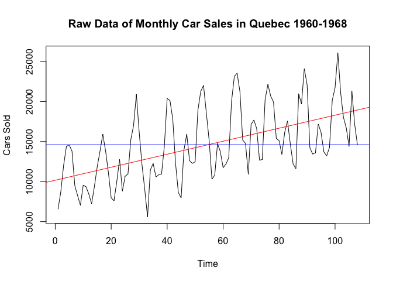

These observations align with the decomposition plot, which breaks down
the time series into trend, seasonality, and residual components. The
“trend” row shows a nearly linear trend, aligning with the upward
trajectory seen in the initial time series plot. Not only does the
consistent seasonal spikes confirm the presence of a repeating pattern,
but the data also shows that the series is non-stationary, as the
patterns exhibit dependency on time. This means that transformation or
differencing is necessary for accurate modeling.  

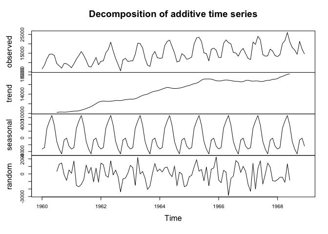

The time series plot of the raw data emphasizes that as the mean
increases with the trend, the variability also grows, changing from
smaller fluctuations at the beginning of the series to larger ones
toward the end. This heteroscedasticity is a key indication of the need
for variance stabilization. Additionally, the histogram shows that the
data is left-skewed, with dips in frequency, while the autocorrelation
function (ACF) shows multiple spikes above the confidence interval,
indicating strong periodicity.

To address these issues, variance stabilization can be achieved through
data transformation, such as logarithmic or power transformations. The
seasonality and trend can be removed by differencing the data so the
series is stationary and suitable for time series modeling.  

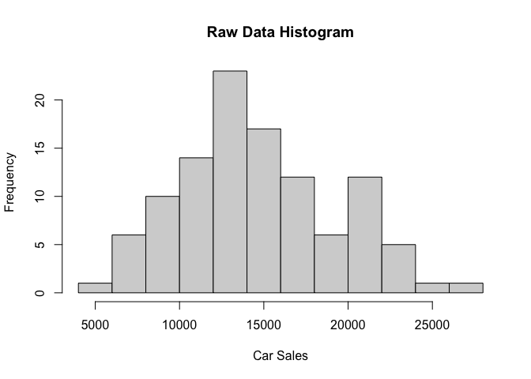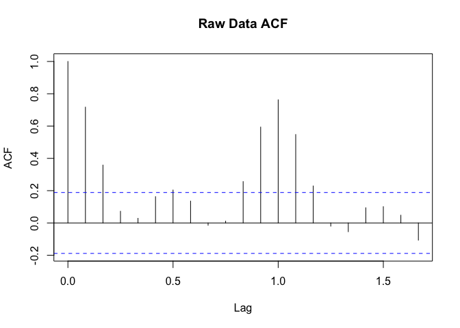

## Box-Cox Transformation

The Box-Cox transformation method allows us to stabilize the variability
in the time series. The graph below reveals the optimal lambda value is
0.26. Since 0 falls within the confidence interval and the lambda value
is relatively close to zero, I opted to use a lambda of 0, which
corresponds to applying a logarithmic transformation. This approach
stabilizes the variance while preserving the underlying patterns in the
data.  

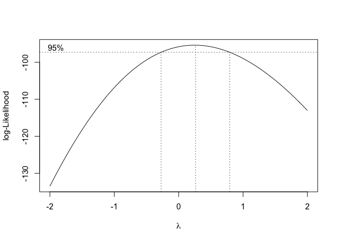

    ## Lambda: 0.2626263

With the transformation complete, the histogram is now smoothed and
approximates a normal distribution, addressing the skewness observed in
the raw data. On the other hand, the line graph of the transformed data
appears similar to the original, as it exhibits more stability, reduced
variability, and less pronounced fluctuations. Since the Box-Cox method
successfully decreased the variance, we will continue with the
transformed data in the analysis, ensuring a stronger foundation for our
time series modeling.  

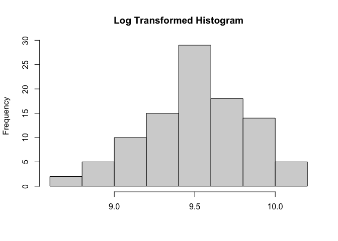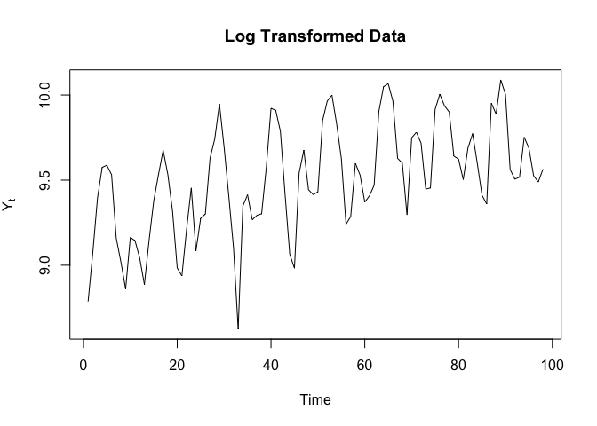

## Differencing

The next step is to remove seasonality and trend by differencing the
data. To achieve this, I compared differencing at lag 1 and lag 12. The
differenced data at lag 1 shows a slight remaining trend and
seasonality, while the differenced data at lag 12 better addresses these
concerns. Additionally, the variance of the differenced data at lag 1 is
lower than at lag 12, confirming that over-differencing has not
occurred. Therefore, using lag 12 provides the best results for removing
seasonality and trend, making it the best choice for further analysis.  

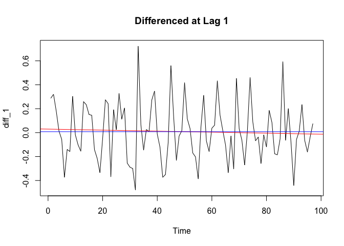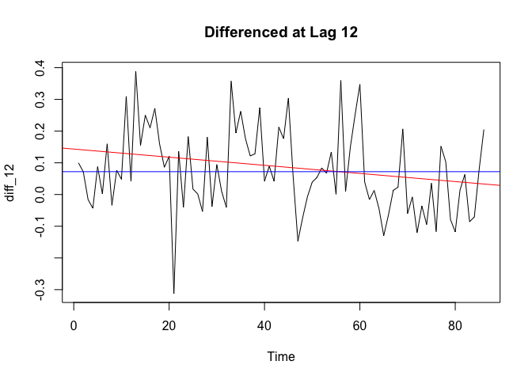

    ## Variance of Difference at Lag 1: 0.0582175

    ## Variance of Difference at Lag 12: 0.01759893

## Model Fitting

Now that the data now de-trended, de-seasonalized, and its variance
stabilized, we can proceed with building a SARIMA model. Since we
applied both a seasonal differencing and a lag 12 differencing to remove
the trend, it is best to set the model parameters as follows: d=1, D=1,
and s=12.

The autocorrelation function (ACF) plot reveals spikes at lags 2 and 12,
indicating autocorrelation at those points but no significant seasonal
trend, leading to the selection of p=2, q=1, Q=0, or Q=1. Meanwhile, the
partial autocorrelation function (PACF) plot shows a noticable spike at
lag 1, supporting the choice of P=1. Based on these observations, this
combination of parameters forms a strong foundation for constructing a
SARIMA model tailored to the dataset.  

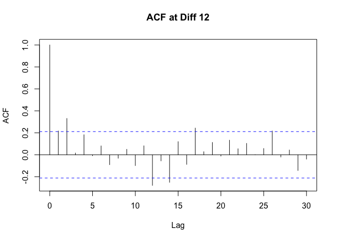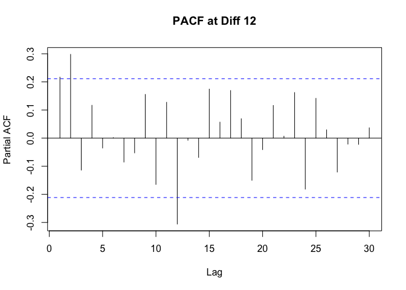

  
Using the choices for the p, d, q, P, D, Q, and s parameters, I
initially created the first model as $\text{SARIMA}(2,1,2)(1,1,1)_{12}$.
However, when calling the ARIMA function, I noticed a problematic
coefficient whose value was -1. To fix this, I adjusted the model by
replacing Q=1 with Q=0; While this resolved the issue, some of the
coefficients remained statistically insignificant, as their confidence
intervals included 0. As a result, I set the coefficients to 0,
refinding the model to be $\text{SARIMA}(2, 1, 2)(1, 1, 0)_{12}$.

The first candidate model equation can be expressed as:
$(1 - B)(1 +0.8602B^{12})X_t = (1 -0.3685B) Z_t$.

This equation reflects a simplified and more stable model, where the
seasonal and non-seasonal components are optimized for forecasting.

    ## 
    ## Call:
    ## arima(x = log(train_data), order = c(2, 1, 2), seasonal = list(order = c(1, 
    ##     1, 0), period = 12), fixed = c(0, 0, NA, 0, NA), method = "ML")
    ## 
    ## Coefficients:
    ##       ar1  ar2      ma1  ma2     sar1
    ##         0    0  -0.8602    0  -0.3685
    ## s.e.    0    0   0.0811    0   0.1013
    ## 
    ## sigma^2 estimated as 0.01474:  log likelihood = 57.01,  aic = -108.01

  
I sought to find another suitable ARMA model using maximum likelihood
estimation. From the loop, it can be shown that the most optimal model
emerged with p=2 and q=4, resulting in a $\text{ARMA}(2, 4)$ model. The
second candidate model equation can be expressed as:

$(1 + 0.4002B - 0.2855B^2)(1 - B^{12}) (1 + 0.3491B - 0.5472B^2)X_t = (1 + 0.2972B) Z_t$

This equation combines both autoregressive and moving average
components, while also accounting for seasonal differencing at lag 12.
This model is also good for capturing the underlying patterns in the
data and enhancing forecasting accuracy.

    ##    q
    ## p             0           1          2         3         4
    ##   0   0.5507344  -0.1412336  -8.705158 -20.34301 -21.84391
    ##   1   0.4724198   1.8770579 -15.557681 -19.40443 -24.93738
    ##   2  -0.8382162 -23.3628468 -26.163219 -23.80102 -26.56381
    ##   3 -11.8970685 -25.0152692 -22.967010 -21.57057 -25.83549
    ##   4 -14.5439964 -12.8567927 -25.081719 -24.55688 -22.54537

    ## 
    ## Call:
    ## arima(x = log(train_data), order = c(2, 1, 4), method = "ML")
    ## 
    ## Coefficients:
    ##           ar1      ar2     ma1     ma2      ma3      ma4
    ##       -0.2328  -0.4726  0.1742  0.2390  -0.6017  -0.5195
    ## s.e.   0.1448   0.1216  0.1491  0.0965   0.0744   0.1292
    ## 
    ## sigma^2 estimated as 0.03667:  log likelihood = 20.74,  aic = -27.49

To select the best fitting model, I evaluated the equations’ accuracy
using the corrected Akaike Information Criterion (AICc), which
calculates the residuals of the model to estimate the accuracy of the
data. The results indicate that the first model has an AICc of -107.36,
while the second model has an AICc of -26.56. Given these findings, the
first model with the lower AICc value is preferred for forecasting, as
it demonstrates a better fit to the data and more reliable predictive
capabilities.  

    ## AICc of Model 1: -107.3592

    ## AICc of Model 2: -26.56381

  
Before continuing with the forecasts, it is important to check for unit
roots in the model to determine whether any additional differencing is
necessary. The left graph illustrates the moving average (MA)
coefficients, while the right graph displays the seasonal autoregressive
(AR) coefficients. Since both coefficients are located outside the unit
circle, we can conclude that the model is invertible. This suggests that
no further transformations of the data is needed and that the model is
ready for forecasting.  

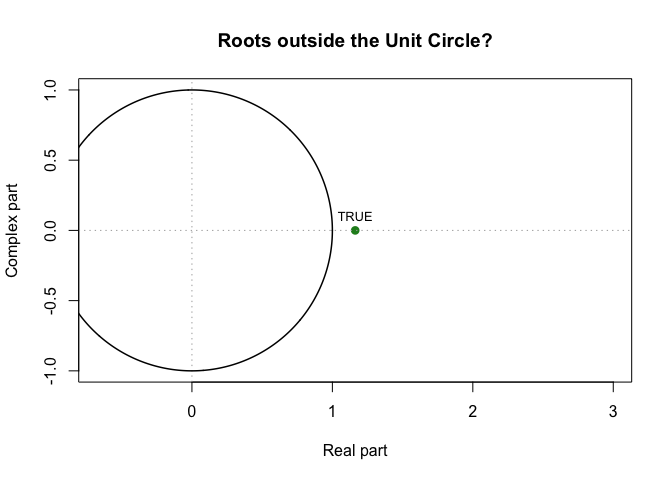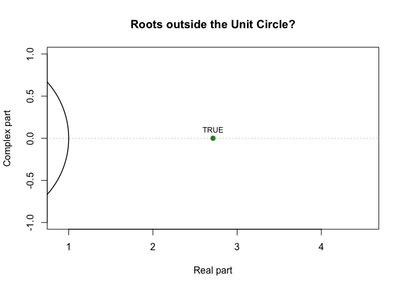

## Diagnostic Check

Now that it is known that the model is both stationary and invertible,
we can continue with diagnostic checking for Model 1. The Q-Q plot,
histogram, and residual plot indicate the residuals resembling Gaussian
white noise, with a mean close to 0. However, the residuals exhibit
non-constant variance, indicating some heteroscedasticity in the model.

Additionally, both the histogram and Q-Q plot reveal heavy tails on
either end, suggesting that the distribution of the residuals may
deviate from normality and that the outliers may not be adequately
captured by the model, meaning that further investigation or potential
adjustments to improve the model fit is necessary.  

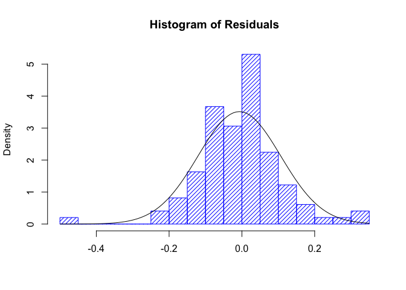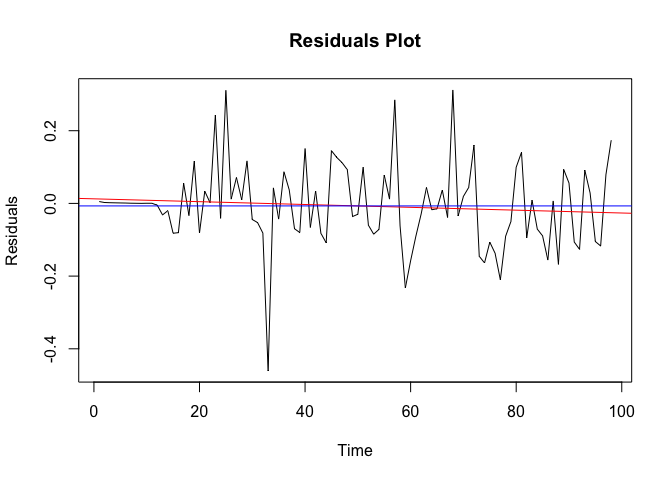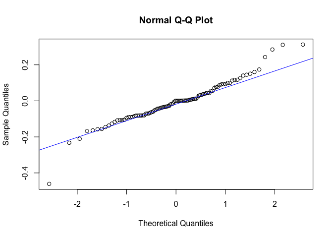

  
To check whether the residuals are consistent with white noise, I
plotted the ACF and PACF of the residuals. Fortunately, all lags in the
ACF plot, excluding lag 0, fall within the dotted lines of the
confidence interval. This means that the residuals resemble Gaussian
white noise, suggesting that there are no significant autocorrelations
remaining in the residuals. This also confirms that the model captures
the underlying patterns in the data and supports the validity of the
chosen SARIMA model.

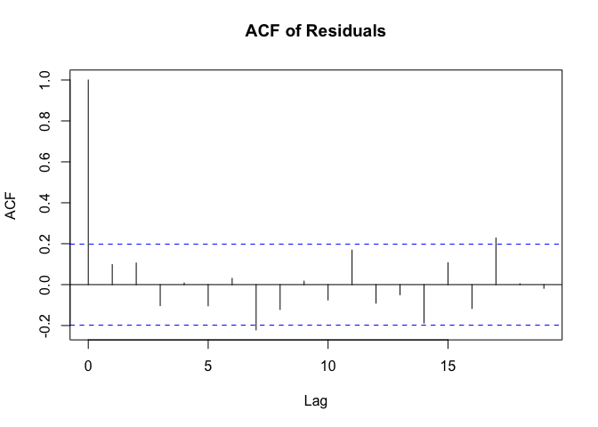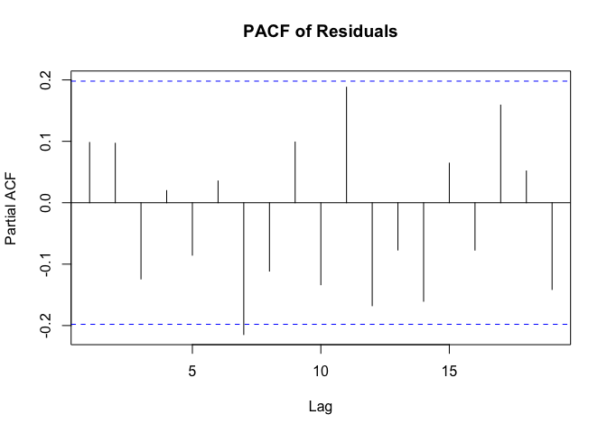

Lastly, I performed the Shapiro-Wilk, Box-Pierce, Ljung-Box, and
McLeod-Li tests on the residuals to further confirm if they resemble
white noise by checking their independence and normality. All tests
passed, with p-values greater than 0.05, except for the Shapiro-Wilk
test, which indicated that the residuals are not normally distributed.

This result aligns with the earlier observation of heavy tails in the
Q-Q plot and histogram. Despite the lack of normality, the residuals
still resemble white noise, meaning they are independent and
uncorrelated, making them acceptable for forecasting. This confirms that
the model is suitable for generating reliable forecasts, even with the
non-normality present.

| Statistical Test | P-Value  |
|:-----------------|:---------|
| Shapiro-Wilk     | 0.001742 |
| Box-Pierce       | 0.1985   |
| Ljung-Box        | 0.1517   |
| McLeod Li        | 0.6634   |

## Forecasting

Now that the best model has been determined, I can display the forecasts
based on the transformed data. The red dots representing the forecasted
values fall within the blue/dotted 95% confidence intervals, indicating
that the predicted values are consistent with the actual data.

To compare the forecasts with the actual values for the last ten months,
it is necessary to reverse the transformations applied to the data. This
includes undoing the differencing at lag 12 and reversing the Box-Cox
transformation to change the forecasts back to their original scale.
This step lets the forecasted values be directly compared to the
observed data in the same scale and context.

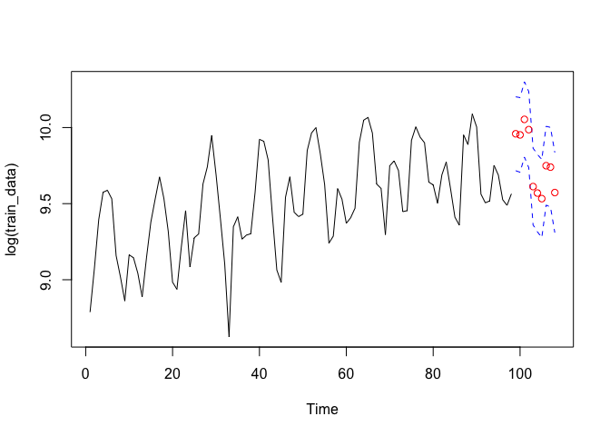

The true values are within the confidence intervals of the forecasts,
which confirms that the model is performing accurately. When comparing
the graph of the forecasted values to the one from the transformed data,
they appear very similar, indicating consistency in the model’s
predictions.

In the zoomed-in view, the closeness of the black circles (which
represent the true values) to the red line (forecasted values) further
emphasizes the model’s accuracy. Additionally, none of the true values
fall outside the blue 95% confidence intervals. This alignment between
the forecast and actual data illustrates that the SARIMA model is
well-suited for forecasting future car sales in Quebec.

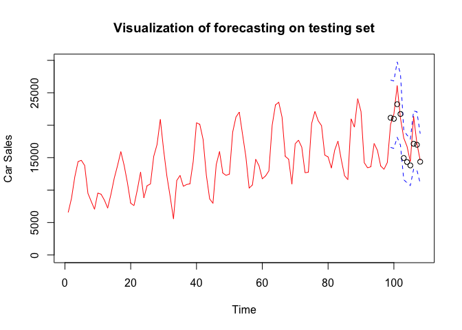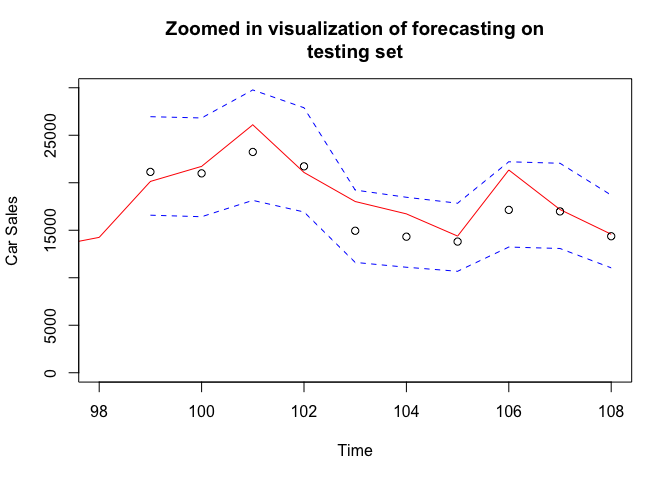

## Conclusion

The goal of this project was to predict future car sales in Quebec by
creating a model of the monthly data. This was achieved through the
application of various time series techniques such as box-cox
transformations, differencing, ARIMA, SARIMA, diagnostic checks, and
unit circle tests. After going through all the procedures, the best
performing model was $\text{SARIMA}(2, 1, 2)(1, 1, 0)_{12}$, with the
equation $(1 - B)(1 +0.8602B^{12})X_t = (1 -0.3685B) Z_t$. Lastly, I
would like to acknowledge Professor Feldman, TAs Cosmin and Lihao, and
classmates Michael Chen, Brian Ho, and James Son for helping me through
this process.

## References

Abraham, B., and J. Ledolter. “Statistical Methods for Forecasting.”
John Wiley & Sons, 1983.  
Hyndman, Rob. “TSDL Library.” TSDL,
<https://pkg.yangzhuoranyang.com/tsdl/>.  
Kelkar, Mihir, et al. “Time-Series Statistical Model for Forecasting
Revenue and Risk Management.”  

## Appendix

``` r
library(forecast)
library(qpcR)
library(tidyr)
library(tsdl)
library(MASS)
library(UnitCircle)

#dataset 4 from TSDL library
data <- tsdl[[9]]

#plotting raw data on time series plot
plot(1:length(data), data, type = 'l', xlab='Time', ylab="Cars Sold", 
     main="Raw Data of Monthly Car Sales in Quebec 1960-1968")
index = 1: length(data)
trend <- lm(data ~ index)
abline(trend, col="red")
abline(h=mean(data) , col='blue')

#decompose the data
components <- decompose(data)
plot(components)

#show the raw data on a histogram and ACF
hist(data, main="Raw Data Histogram", xlab="")
acf(data, main="Raw Data ACF")

#split the data, leave the last 10 values out
train_data <- data[1:98]
test_data <- data[99:108]

#box-cox transformation and lambda value
bcTransform <- boxcox(as.numeric(train_data)~ 
                        as.numeric(1:length(train_data)))
cat("Lambda:", bcTransform$x[which(bcTransform$y == max(bcTransform$y))])

#log transformed histogram and time series plot
hist(log(train_data), main="Log Transformed Histogram", xlab="")
ts.plot(log(train_data), main = "Log Transformed Data", 
        ylab = expression(Y[t]))

#differencing log(data) at 1 and plot
diff_1 <- diff(log(train_data))
plot.ts(diff_1, main="Differenced at Lag 1",
        xlab='Time')
abline(lm(diff_1 ~ time(train_data)[-1]), col='red') #trend line
abline(h=mean(na.omit(diff_1)), col='blue') #mean line

#differencing log(data) at 12 and plot
diff_12 <- diff(log(train_data), 12)
plot.ts(diff_12, main="Differenced at Lag 12")
abline(lm(diff_12 ~ time(train_data)[-c(1:12)]), col='red') #trend line
abline(h=mean(na.omit(diff_12)), col='blue') #mean line

#check the variances between both differencings
var_1 <- var(diff_1, na.rm = TRUE)
var_12 <- var(diff_12, na.rm = TRUE)
cat("Variance of Difference at Lag 1:", var_1, "\n")
cat("Variance of Difference at Lag 12:", var_12)

#diff_12 has a smaller variance, plot ACF/PACF
acf(diff_12, main='ACF at Diff 12', lag.max=30)
pacf(diff_12, main='PACF at Diff 12', lag.max=30)

#first model SARIMA(2,1,2)(1,1,1)12
m1 <- arima(x = log(train_data), order = c(2,1,2), 
            seasonal = list(order = c(1,1,1), period = 12), method = "ML")

#fit 1 of model 1
fit_m1 <- arima(log(train_data), order=c(2,1,2), 
                seasonal=list(order=c(1, 1, 0), period=12), 
                 method="ML")

#fit 2 of model 1
fit2_m1 <- arima(log(train_data), order=c(2,1,2), 
                seasonal=list(order=c(1, 1, 0), period=12), 
                fixed=c(0, 0, NA, 0, NA), method="ML"); fit2_m1 #best fit

#check best ARMA fit
aiccs <- matrix(NA, nr = 5, nc = 5)
dimnames(aiccs) = list(p = 0:4, q = 0:4)

#for loop for ARMA fit
for (p in 0:4) {
  for (q in 0:4) {
    aiccs[p + 1, q + 1] = AICc(arima(log(train_data), 
                                     order = c(p, 1, q), method = "ML"))
  }
}
aiccs #compare values
(aiccs==min(aiccs)) #find the minimum value
m2 <- arima(log(train_data), order = c(2,1,4), method="ML"); m2

#compare AICcs of each model
cat("AICc of Model 1:", AICc(fit2_m1))
cat("AICc of Model 2:", AICc(m2))

#check whether model 1 coefficients are outside unit circle
ma_coef <- c(1, -0.8602)
seasonal_ar_coef <- c(1, -0.3685)
uc.check(pol = ma_coef, plot_output = TRUE) #roots of MA of model A
uc.check(pol = seasonal_ar_coef, plot_output = TRUE) #roots of SAR of model A

#plot residuals to show normality
res <- residuals(fit2_m1)
hist(res,density=20,breaks=20, col="blue", xlab="", 
     prob=TRUE,main="Histogram of residuals of model B") #histogram
m <- mean(res)
std <- sqrt(var(res))
curve( dnorm(x,m,std), add=TRUE )
plot.ts(res,ylab= "residuals of model B",main="Residuals plot of model B")
fitt <- lm(res ~ as.numeric(1:length(res))) #residual plot
abline(fitt, col="red")
abline(h=mean(res), col="blue")
qqnorm(res,main= "Normal Q-Q Plot for Model B") #qqnorm plot
qqline(res,col="blue")

#residuals are within CIs in ACF/PACF
acf(res, main="ACF of Residuals")
pacf(res, main="PACF of Residuals")

#diagnostic residuals check
shapiro.test(res) #shapiro-wilk
Box.test(res, type = c("Box-Pierce"), lag = 10, fitdf=2) #box-pierce
Box.test(res, type = c("Ljung-Box"), lag = 10, fitdf=2) #ljung-box
Box.test(res^2, type = c("Ljung-Box"), lag = 10, fitdf=0) #mcleod li

#forecasting on transformed data
pred.tr <- predict(fit2_m1, n.ahead = 10)
U.tr= pred.tr$pred + 2*pred.tr$se
L.tr= pred.tr$pred - 2*pred.tr$se
ts.plot(log(train_data), xlim=c(1,length(log(train_data))+10), ylim =
          c(min(log(train_data)),max(U.tr)))
lines(U.tr, col="blue", lty="dashed")
lines(L.tr, col="blue", lty="dashed")
points((length(log(train_data))+1):(length(log(train_data))+10), 
       pred.tr$pred, col="red")

pred.orig <- exp(pred.tr$pred)
U= exp(U.tr)
L= exp(L.tr)

#zoomed out forecasting
ts.plot(as.numeric(data), ylim = c(0,max(U)),col="red",
        ylab="Car Sales",main="Visualization of forecasting on testing set")
lines(U, col="blue", lty="dashed")
lines(L, col="blue", lty="dashed")
points((length(train_data)+1):(length(train_data)+10), pred.orig, col="black")

#zoomed in forecasting
ts.plot(as.numeric(data), xlim = c(98,length(train_data)+10), 
        ylim = c(200,max(U)),col="red",ylab="Car Sales",
        main="Zoomed in visualization of forecasting on testing set")

lines(U, col="blue", lty="dashed")
lines(L, col="blue", lty="dashed")
points((length(train_data)+1):(length(train_data)+10), pred.orig, col="black")
```
